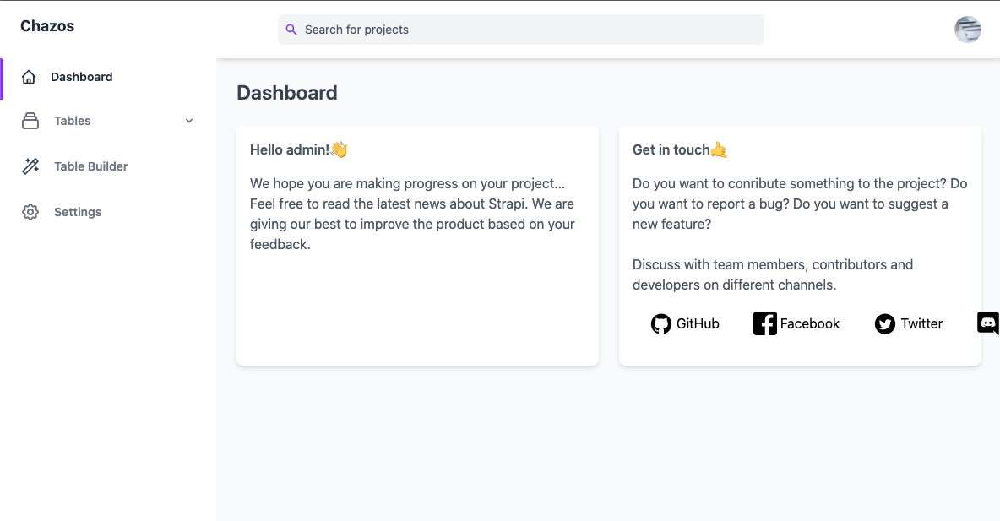
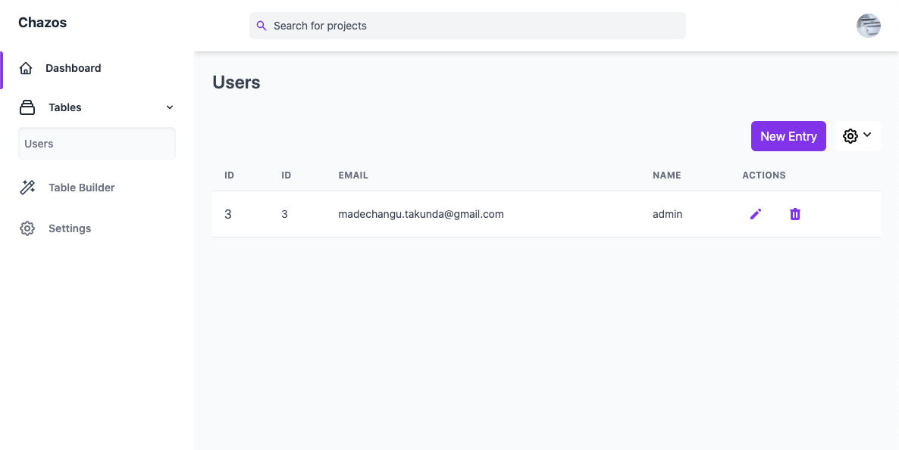
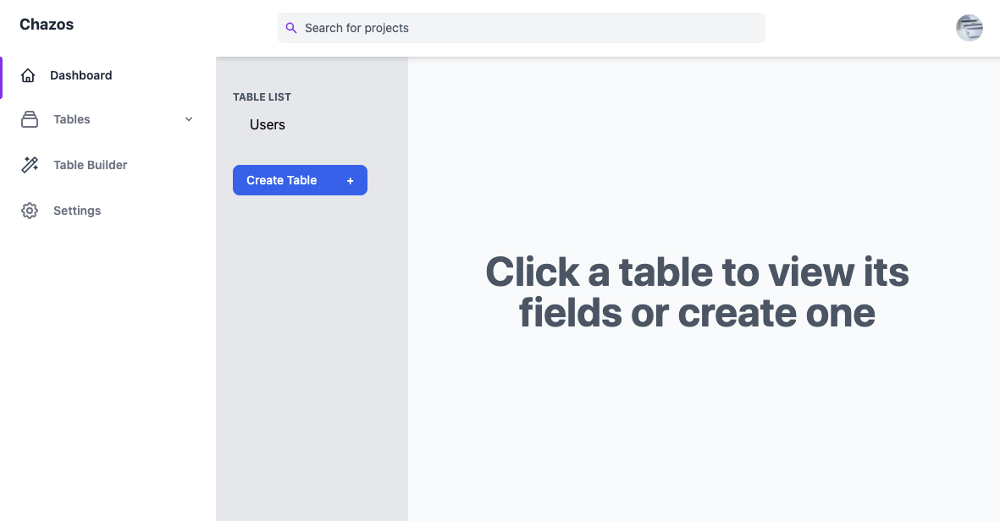
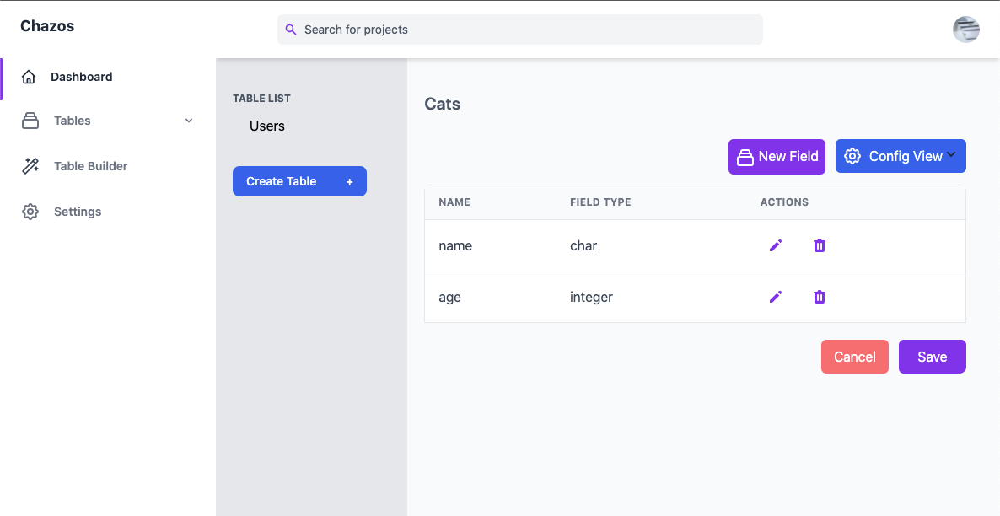
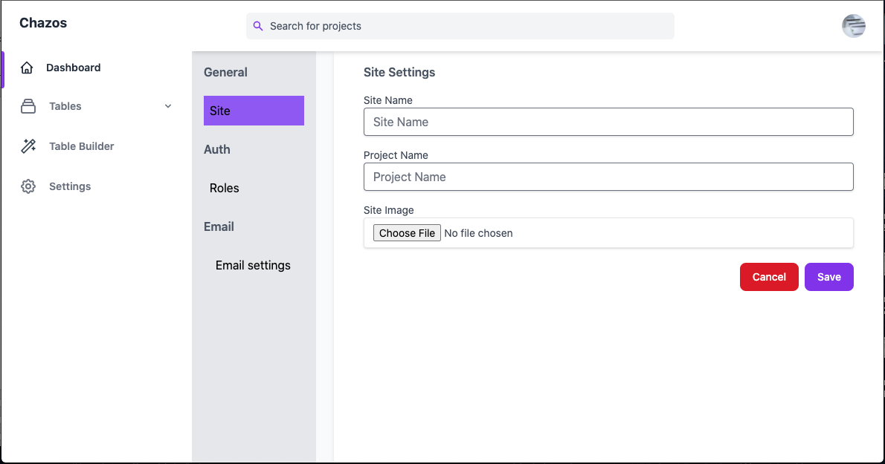

## Chazos

Chazos is headless CMS built with Laravel. It is a simple CMS that allows you to create and manage your content, and you can consume this content using a REST API.

It should be used as a backend for websites, web apps and mobile apps.

Chazos is a greek work for stupid. Someone who is stupid is someone who is brainless or headless 😁. 

### How to install

0. Create your database first

1. Clone the project

    `git clone https://github.com/takumade/chazos.git`

2. Navigate to the project folder

    `cd chazos`

3. Modify .env file or create one. **Make sure your have composer and PHP >= 7.4 installed.**
    

4.  Run install

    `./install.sh` ( for Mac OS/Linux)  or `install.bat` ( for Windows)

8. Serve it

    `php artisan serve`

### Deploy on shared hosting 🚀

1. Type the following

`sh deploy_shared.sh`

**Do this putting the file on server, since it also runs optimize commands**

### Make develop ready 👨🏽‍💻

1. Type the following

`sh develop.sh`

**If you want to make a pull request clean the project first**

`php artisan project:clean`

### Screenshots

**Dashbaord**

**Tables**

**Table Builder**

**Table Builder 2**

**Table Builder 1 Modal**

**Settings**

### Todo

#### Features

##### Overrally
✅ Add alerts

✅ Add develop and deploy scripts

✅ Populate seeder with 
     - create all roles 
     - CRUD permissions for user table

⏳ Refactor the code(bi-weekly)

✅ Add `project:deploy command which everything not core to the system`

##### Dashboard
✅ Add something stupid and simple

##### Content Section 
✅ View content

✅ Add content

✅ Edit content

✅ Delete Content

✅ Add pagination in manage content

⏳ Specify amount to show in pagination(v2)

✅ Search through content

✅ Allow users to bulk import data(CSV)

✅ Allow users to export data(CSV/JSON)

✅  Bulk delete content

##### Table Builder
✅ Create Table

✅ Specifiy Table Fields

✅ Allow admin to edit tables

✅ Allow admin to edit table columns

⏳ Add relationships between documents

##### API
✅ Get Content

✅ Get Content Detail

✅ Delete Item

##### Media
⏳ Add media section

⏳ Show Media

⏳ Upload Media

⏳ Get Media Link

#### Payments
⏳ View Payments

⏳ Integrate Stripe

⏳ Integrate Paypal

⏳ Integrate Paynow

#### Settings
✅  Add settings

✅  Allow admin to add roles

⏳ Allow admin change colors

⏳ Allow admin to change email templates

✅  Email configuration settings
